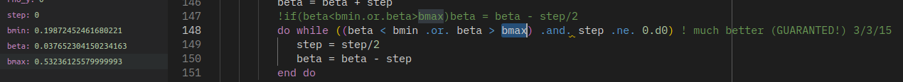

# Casos de estudio: Envolventes incompletas

## Caso 1

{width=50%}

### Envolvente arrepentida

Una envolvente de burbuja se arrepiente de su recorrido por lo que el
algoritmo asume un equivocado caso 3

{width=40%}\ {width=40%}

## Caso 2

{width=50%}

De aqui se tomaron dos casos particulares

### Curva de rocio igual a curva de alta presion LL

{width=50%}

Se puede observar que se calcularon las dos líneas cuando en realidad
debería de ser todo una misma.

Habría que ver de hacer más estricto el corte de la envolvente de rocío,
cosa de que recorra un poco más antes de que corte la línea

### Curva de rocio igual a curva de alta presion LL
{width=60%}

Además de esto, nunca se le asigna un valor a la variable PlowT
(inicializadora de curva trifásica), lo que no permite que se calculen
las líneas trifásicas. Esto tiene fácil solución ahora que en el código
actualizado se guardan todos los puntos, así que se podría simplemente
extraerlo de ahí.

En este caso la curva de alta presión termina arriba de 1 bar (\~5bar)
por lo que el algoritmo no lo considera en ningún caso, no se hace el
cálculo de curva de burbuja necesario para luego buscar cruces e
inicializar trifásicas.

### Envolvente ambiciosa

Una envolvente trifásica que recorre más de lo que debería, inclusive
pasa por la línea de equilibrio bifásico.

{width=50%}

# Caso 3

{width=50%}

### Curva trifásica no inicializa

En este caso la segunda curva trifásica (LAOP) no puede inicializarse.

Más allá de la corrección de la inicialización, creo que sería importante tener
en cuenta si llegamos a considerar que el comportamiento de tipo cuatro debería
de calcularse de su propia manera particular, ya que posee una línea entera
continua en lugar de ser dos líneas separadas, hubo algunos casos en los cuales
la línea inferior continuaba sobre la superior hasta su origen.

### Curva trifásica no inicializa
{width=50%}

### Curva trifásica no inicializa

En una variante del *caso 1* (en el que tampoco se inicializa la segunda
curva trifasica), se vio que un cálculo Flash devuelve una composición
mayor a uno en la fase w.

### Curva trifásica no inicializa

{width=50%}

En ese Flash, al tratar de mantener a beta dentro del rango de betamin y
betamax, se llega a un step igual a cero.

### Curva trifásica no inicializa

{width=50%}

Con el ajuste, se llega a que la fase de asfaltenos no es la mayoritaria
en los flashes (no estoy seguro si es relevante)

### Curva trifásica no inicializa

{width=50%}

La envolvente trifásica sigue sin converger, en el cálculo del primer
punto pareciese que converge sólo una fase.

### Curva trifásica no inicializa

{width=50%}

Se vio que la inicializacion de la segunda trifasica es desde el punto
que normalmente es final de la envolvente (baja P y "alta" T)

{width=50%}

### Envolvente trifásica muere en el crítico

Una envolvente trifásica llega a calcular el punto crítico pero no
continua para finalizar el recorrido completo

{width=50%}

### Envolvente trifasica muere antes de crítico

Una envolvente trifásica no pudo llegar siquiera detectar el punto
crítico (línea verde).

{width=50%}
