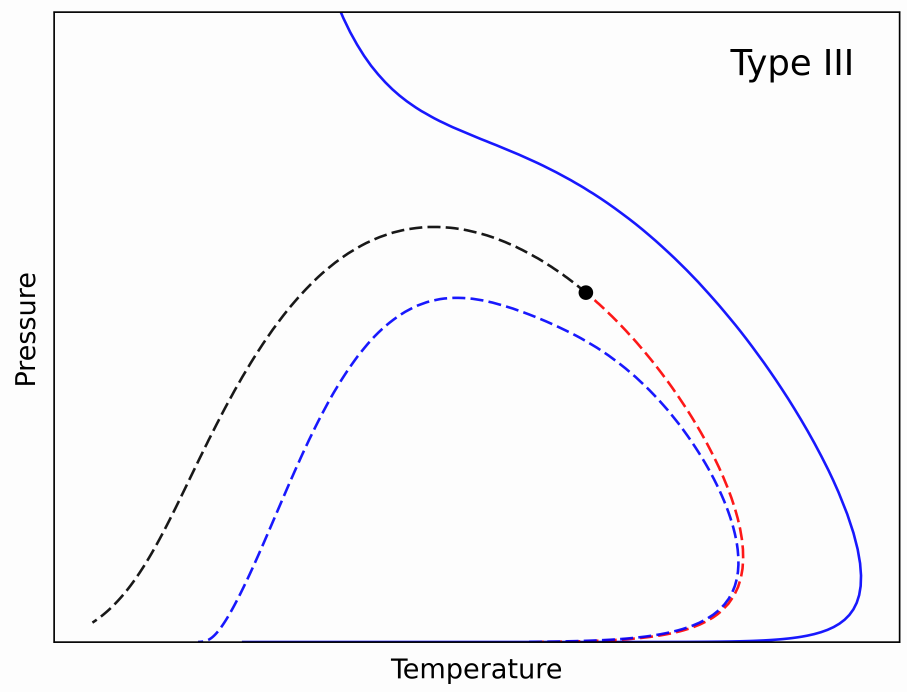
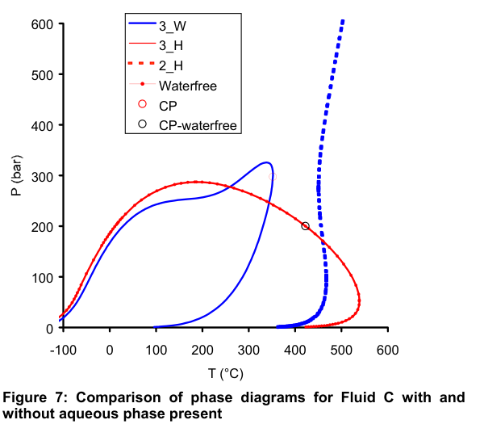

# Introducción

## Equilibrio de fases
En los procesos industriales es muy común que exista la necesidad de calcular
un equilibrio de fases, ya sea para una extracción, un proceso de separación,
etc.

{width=70%}

## Equilibrio de fases
Para que un sistema esté en equilibrio es necesario que se den las condiciones.

### Condiciones

::: columns

::: column

> $T^{V} = T^{L}$ 

\

> $P^{V} = P^{L}$

\

> $f_i^V = f_i^L$

:::

::: column

{width=50%}

:::

:::

## Cálculo flash
En una operación, puede ser importante determinar la composición de fases en
equilibrio. Para esto puede realizarse un cálculo Flash.

::: columns

::: column

\ 

$K_i = \frac{y_i}{x_i} = \frac{\phi_i^L(x, p, T)}{\phi_i^V(y, p, T)}$

\

$\sum_i^N(y_i - x_i)$

\

$z_i = \beta y_i + (1-\beta) x_i$

:::

::: column

:::

:::
## Puntos de saturación
Puntos de transición donde aparece una fase incipiente

- Puntos de burbuja.
- Puntos de rocío.

# Envolventes de fases

## Envolventes de fases
La unión de todos los puntos de saturación a $z=cte$ se la denomina envolvente
de fases.

{width=80%}

## Envolventes de fases

## Envolvente bifásica: Cálculo
Una envolvente bifásica puede calcularse resolviendo el sistema de ecuaciones:

\begin{align*}
\ln K_i - (\ln \phi_i^l(x, p, T) - \ln \phi_i^v(y, p, T)) = 0 \\
\sum_i^N (y_i - x_i) = 0 \\
\end{align*}

Punto a punto, mediante un método de _continuación numérica_

## Método de continuación
Método que realiza el trazado de líneas obtenidas a partir de sistemas de ecuaciones
complejos de resolver mediante método Newton.

## Método de continuación: Ejemplo simple

Se desea trazar la ecuación de un círculo:

$x^2 + y^2 = 1$

De por si el sistema está subespecificado (GL > 0), por lo que es necesario
agregar una ecuación extra:

$x - x_0 = 0$ (punto $x_0$ donde se desea resolver el sistema)

## Método de continuación: Ejemplo simple (Resolución Newton)

::: columns

::: column

\begin{equation*}
F = \begin{bmatrix}
x^2 + y^2 - 1\\
x - x_0 \\
\end{bmatrix}
= 0
\end{equation*}

\begin{equation*}
J = \begin{bmatrix}
2x & 2y \\
1 & 0 \\
\end{bmatrix}
\end{equation*}

\

$J(X_i) \Delta X + F(X_i) = 0$

:::

::: column
$X_0 = [0.5 \ -1]$

$X_3 = [ 0.5 \ -0.87 ]$

\

Ahora, si se toma $X_0 = [1 \ 0]$ 

La matriz jacobiana es:

\begin{equation*}
J = \begin{bmatrix}
2 & 0 \\
1 & 0 \\
\end{bmatrix}
\end{equation*}

Singular! No sirve esta inicialización.

:::

:::

## Metodo de conditunacion: Seleccion de especificacion

Variable de especifcacion dinamica

::: columns

::: column

\begin{equation*}
F = \begin{bmatrix}
x^2 + y^2 - 1\\
X_s - S \\
\end{bmatrix}
= 0
\end{equation*}

\begin{equation*}
J = \begin{bmatrix}
2x & 2y \\
\frac{dF_2}{dx} & \frac{dF_2}{dy} \\
\end{bmatrix}
\end{equation*}

:::

::: column

Se determina que tanto varian las variables con respecto a la especificacion

\

$J \frac{dX}{dS} + \frac{\partial F}{\partial S} = 0$

\

$X_{new} = X_{old} + \frac{dX}{dS} \Delta S$

:::

:::

## Método de continuación: Envolvente bifasica
\begin{align*}
\ln K_i - (\ln \phi_i^l(x, p, T) - \ln \phi_i^v(y, p, T) = 0 \\
\sum_i^N (y_i - x_i) = 0 \\
X_S - S = 0 \\
\end{align*}

Donde S es una variable de especificación (por ejemplo T o P)

## Envolventes: Dificultades

- Buena inicialización
- Correcta de detección de puntos críticos
- Casos con mucha asimetría

## Envolventes: Dificultades (PC)
Al acercarse a un punto crítico 

$x_i \approx y_i \rightarrow K_i \approx 1$

{width=70%}

## Envolventes: Dificultades (PC)
Al acercarse a un punto crítico 

$x_i \approx y_i \rightarrow K_i \approx 1$

{width=70%}

## Envolventes: Dificultades (Asimetría)
En sistemas muy asimétricos, pueden surgir otros tipos de problemas.

## Envolventes: Dificultades (Asimetría)
{width=80%}

## Envolventes: Dificultades (Asimetría)

## Envolventes: Dificultades (Asimetría)
Estos casos son indicadores de posibles equilibrios trifásicos.

## Envolvente trifásica
Para resolver un sistema en equilibrio trifásico se añade otro set de
ecuaciones, correspondiente a equilibrio y balance de la fase nueva.

\begin{align*}
\ln K_i - (\ln \phi_i^{L1}(x, p, T) - \ln \phi_i^V(x, p, T)) = 0 \\
\sum_i^N (y_i - x_i) = 0 \\
\sum_i^N (x_i - w_i) = 0 \\
\ln K^s_i - (\ln \phi_i^{L2}(w, p, T) - \ln \phi_i^{L1}(x, p, T)) = 0 \\
X_S - S = 0
\end{align*}

## Envolventes trifásicas: Dificultades
Incrementa la dificultad

- Correctas inicializaciones
- Puntos críticos

## Envolventes trifásicas: Ejemplo de fluido de reservorio con asfaltenos
{width=70%}

## Envolventes trifásicas: Ejemplo de fluido de reservorio con asfaltenos
{width=70%}

## Envolventes trifásicas: Ejemplo de fluido de reservorio con asfaltenos
{width=70%}

## Envolventes trifásicas: Ejemplo de fluido de reservorio con asfaltenos
{width=70%}

## Envolventes trifásicas: Ejemplo de fluido de reservorio con asfaltenos

{width=40%}\ {width=40%}

{width=40%}

## Envolventes trifásicas: Casos fallutos
{width=80%}

## Envolventes trifásicas: Casos fallutos
{width=80%}

## Envolventes trifásicas: Hidrocarburos-Agua
{width=80%}

## Envolventes trifásicas: Hidrocarburos-Agua
{width=80%}

## Envolventes trifásicas: Hidrocarburos-Agua
{width=80%}

## Envolventes trifásicas: Hidrocarburos-Agua
{width=80%}

## Envolventes trifásicas: Hidrocarburos-Agua
{width=80%}

## Futuro

- Encontrar más casos.

- Perfeccionar algoritmos:
    - Incluir casos nuevos.
    - Asegurar convergencia de casos conocidos.

